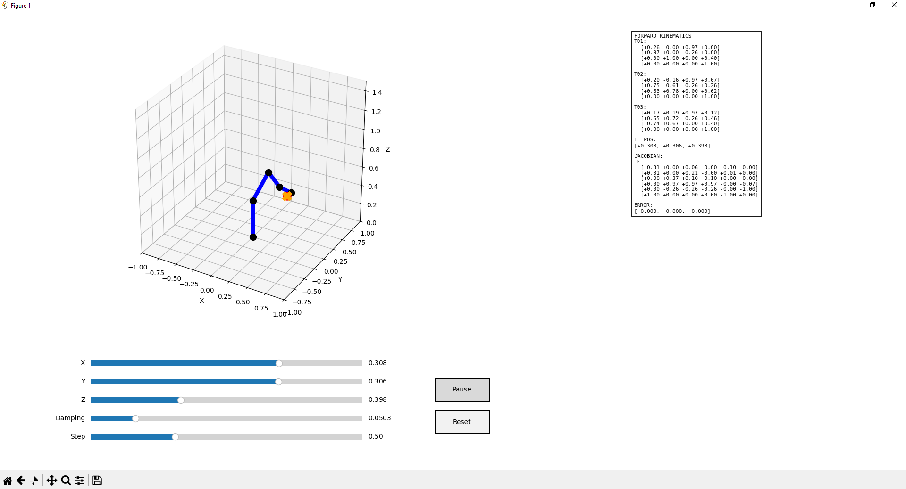

# 6-DOF Robot Arm Simulation with Forward and Inverse Kinematics

An interactive Python simulation of a 6-degree-of-freedom robotic manipulator using Denavit–Hartenberg (DH) parameters, Forward Kinematics, Jacobian computation, and Damped Least Squares (DLS) Inverse Kinematics.

The project provides a real-time 3D visualization using Matplotlib, allowing users to move a target point and watch the robot automatically solve for joint angles to reach it.

---

## Features

- 6-DOF serial robot arm modeled using standard DH parameters
- Forward Kinematics using homogeneous transformation matrices
- 6×6 geometric Jacobian computation
- Inverse Kinematics using Damped Least Squares (DLS)
- Joint limit enforcement
- Interactive 3D visualization
- Real-time target manipulation with sliders
- Adjustable damping and step size
- Reset and pause controls
- Live display of:
  - Transformation matrices
  - Jacobian matrix
  - End-effector position
  - Position error vector

---

## Technologies Used

- Python 3.x
- NumPy
- Matplotlib

---

## Project Structure

```text
robot-arm-simulation/
│── robot_arm.py
│── README.md
│── requirements.txt
```

---

## Mathematical Concepts

### Forward Kinematics

The end-effector pose is computed as the product of DH transformation matrices:

```math
T_0^n = A_1 A_2 \cdots A_n
```

### Jacobian Matrix

The geometric Jacobian maps joint velocities to end-effector velocities:

```math
\dot{x} = J(q)\dot{q}
```

### Damped Least Squares Inverse Kinematics

Joint updates are computed using:

```math
\Delta q = \alpha J^T (J J^T + \lambda^2 I)^{-1} e
```

where:

- `e` = position error vector
- `λ` = damping factor
- `α` = step size

---

## Installation

### 1. Clone the Repository

```bash
git clone https://github.com/yourusername/robot-arm-simulation.git
cd robot-arm-simulation
```

### 2. Create a Virtual Environment (Optional)

```bash
python -m venv venv
```

Activate it:

**Windows**
```bash
venv\Scripts\activate
```

**Linux / macOS**
```bash
source venv/bin/activate
```

### 3. Install Dependencies

```bash
pip install numpy matplotlib
```

Or using `requirements.txt`:

```bash
pip install -r requirements.txt
```

---

## requirements.txt

```txt
numpy
matplotlib
```

---

## Usage

Run the simulation:

```bash
python robot_arm.py
```

---

## Controls

### Target Position Sliders

- **X**: Move target along the X-axis
- **Y**: Move target along the Y-axis
- **Z**: Move target along the Z-axis

### IK Parameters

- **Damping**: Controls numerical stability near singularities
- **Step**: Controls convergence speed

### Buttons

- **Reset**: Return all joint angles to zero
- **Pause**: Pause or resume the simulation

---

## Visualization

The simulation window contains:

1. **3D Robot Plot** — Displays links, joints, end-effector, and target
2. **Control Panel** — Sliders and buttons
3. **Information Panel** — Shows matrices and error metrics

### Color Scheme

- Blue links
- Black joints
- Red end-effector
- Orange target
- Dashed line representing position error

---


## Key Functions

| Function | Description |
|--------|--------|
| `dh_matrix()` | Builds a single DH transformation matrix |
| `forward_kinematics()` | Computes transformations to all joints |
| `compute_jacobian()` | Computes the geometric Jacobian |
| `dls_step()` | Performs one inverse kinematics iteration |
| `RobotViz.draw()` | Updates the 3D visualization |
| `RobotViz.run()` | Starts the simulation loop |

---

## Screenshots

Add screenshots after running the project:

```markdown

```
---


## Acknowledgments

- Denavit–Hartenberg convention
- Jacobian-based robot control
- Damped Least Squares inverse kinematics
- NumPy
- Matplotlib